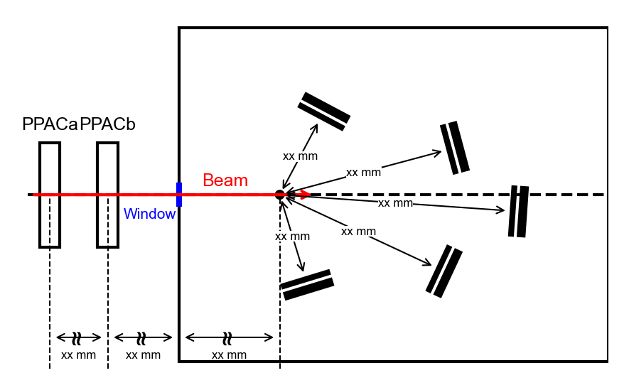

# F3 drawing using Python

Tool for drawing CRIB F3 chamber set-up diagrams using python.
It creates a 2D diagram viewed from the vertical direction; adjust and write the yaml file.

The advantage is that the **eps** format can be output directly, along with the **png** format.

